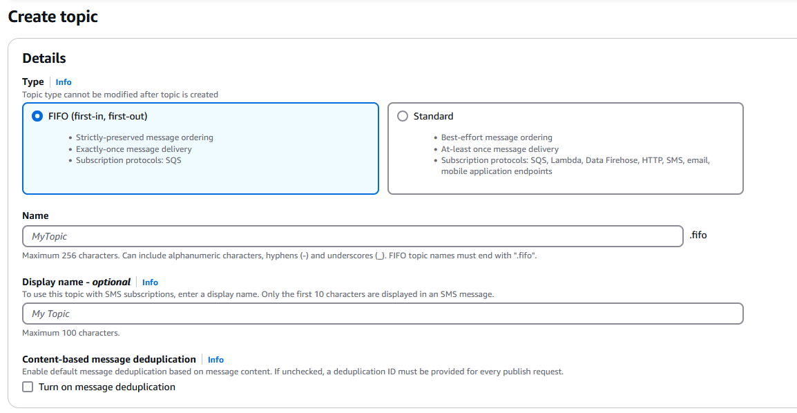

# Serverless-Architecture-SQS-SNS-EventBridge-Lambda

## Answer the following:
### Does SNS guarantee exactly once delivery to subscribers?  
  
Amazon SNS FIFO (First-In-First-Out) topics provide exactly-once message delivery to subscribers, given certain conditions are met:
* The subscriber is an Amazon SQS queue that has permissions that allow the Amazon SNS service principal to deliver messages to the queue.
* The Amazon SQS FIFO queue consumer processes the message and deletes it from the queue before the visibility timeout expires.
* Must avoid message filtering which can lead to at-least-once delivery behaviour.
* No network disruptions that prevent acknowledgment of the message delivery.  

Source [Amazon SNS message deduplication for FIFO topics](https://docs.aws.amazon.com/sns/latest/dg/fifo-message-dedup.html)
### What is the purpose of the Dead-letter Queue (DLQ)? This a feature available to SQS/SNS/EventBridge.  
The Dead-letter Queue (DLQ) in AWS services like SQS, SNS, and EventBridge is a mechanism to capture undeliverable or failed messages or events, ensuring they are not lost and can be analyzed and processed later. The benefits of dead-letter queues include:
* Reduced communication costs: By routing undeliverable messages to DLQs, the system avoids repeated attempts to process or deliver problematic messages, which could result in unnecessary resource usage and costs.
* Improved troubleshooting: Moving erroneous messages to the DLQ, helps developers identify the causes of errors. Developers can investigate why the receiver couldn't process the messages, apply the fixes, and perform new attempts to deliver the message

Source [What is a Dead-Letter Queue (DLQ)?](https://aws.amazon.com/what-is/dead-letter-queue/)
### How would you enable a notification to your email when messages are added to the DLQ?  
It is possible configure an alarm for any messages moved to a dead-letter queue using Amazon CloudWatch and the metric ApproximateNumberOfMessagesVisible.  

Source [Create alarms for dead-letter queues using Amazon CloudWatch](https://docs.aws.amazon.com/AWSSimpleQueueService/latest/SQSDeveloperGuide/dead-letter-queues-alarms-cloudwatch.html)
